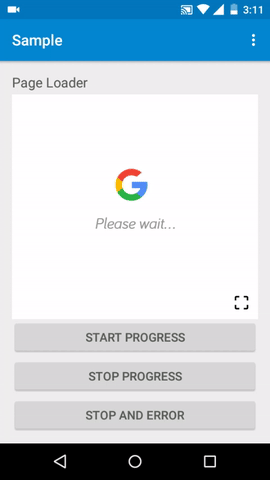

# PageLoader
 [](http://android-arsenal.com/details/1/4761)
 
PageLoader is a simple android library for loading page with easy customization. Built by [Arie Ridwansyah](https://github.com/arieridwan8).


## Setup
Add __PageLoader__ to your dependencies block:
```groovy
dependencies {
    implementation 'id.arieridwan:pageloader:0.0.2'
}
```
## Usage
### PageLoader
Add a `PageLoader` to your layout just like any other view.
```xml
<id.arieridwan.lib.PageLoader
    android:id="@+id/pageloader"
    android:layout_width="match_parent"
    android:layout_height="match_parent">
```
Define the action to load the page or displaying error page on the event
```java
SomeMethod(){
pageLoader.startProgress();
...
    onComplete(){
        ...
    }
    onNext(){
        ...
        pageLoader.stopProgress();
    }
    onError(){
        ...
        pageLoader.stopProgressAndFailed();
    }
}
```
Set onClickListener  when error page is displayed
```java
pageLoader.setOnRetry(new View.OnClickListener() {
            @Override
            public void onClick(View view) {
                pageLoader.startProgress();
            }
        });
```
You can easily customize the text for loading page or when displaying the error page then change the dimensions with following attribute
```xml
app:setLoadingText="Please wait..."
app:setErrorText="Something happened"
app:setTextColor="@color/black"
app:setTextSize="16sp"
```
Or you can change the image for loading or error page and set the dimensions of the image
```xml
app:setLoadingImage="@drawable/ic_search"
app:setErrorImage="@drawable/ic_not_found"
app:setLoadingImageHeight="64dp"
app:setLoadingImageWidth="64dp"
app:setErrorImageHeight="64dp"
app:setErrorImageWidth="64dp"        
```
And also you can change the animation mode
```xml
app:setLoadingAnimationMode="rotate"
app:setLoadingAnimationMode="flip"
app:setLoadingAnimationMode="vibrate"
app:setLoadingAnimationMode="shake"
app:setLoadingAnimationMode="bounce"
```
And then, you can using custom animation or custom font
```java
pageLoader.setCustomAnimation(myAnimation);
pageLoader.setCustomFont(myTypeface);
```
## Screenshot
<p>


</p>

## To Do 
- [ ] setDefaultFontEnabled
- [ ] setLoadingProgressModeEnabled

## Credits
Arie Ridwansyah

## License
PageLoader is under [Apache License 2.0](https://github.com/arieridwan8/pageloader/blob/master/LICENSE.txt).

